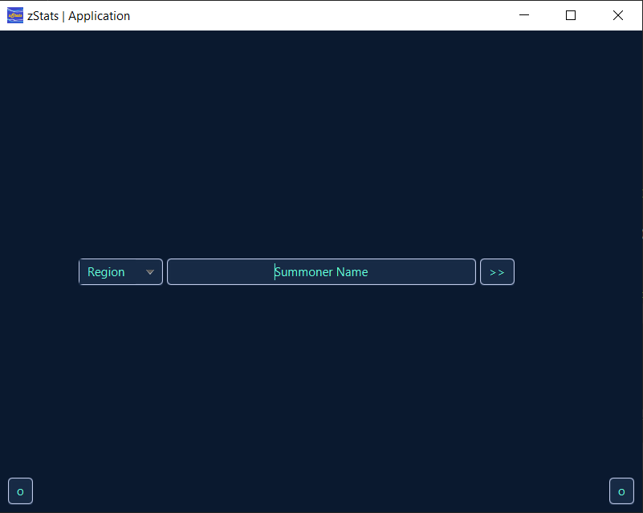
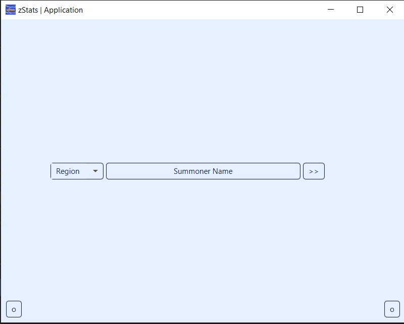
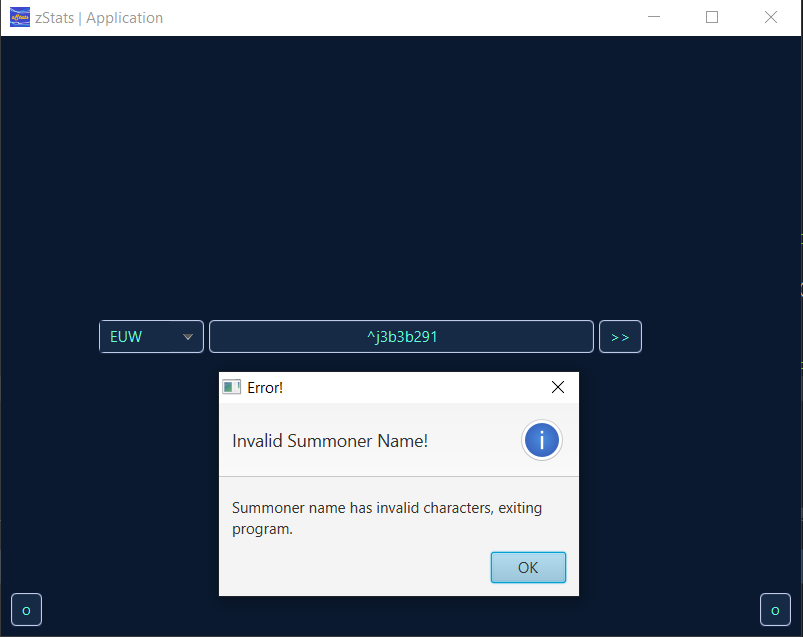
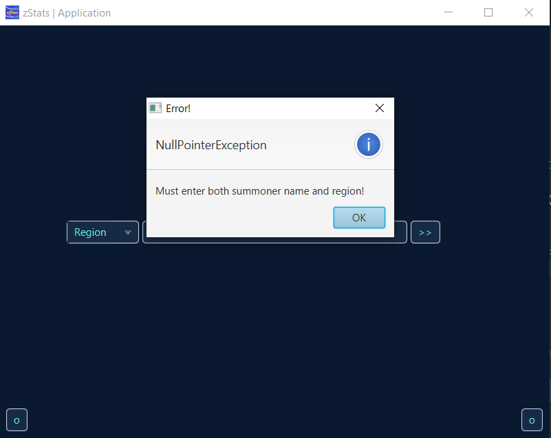
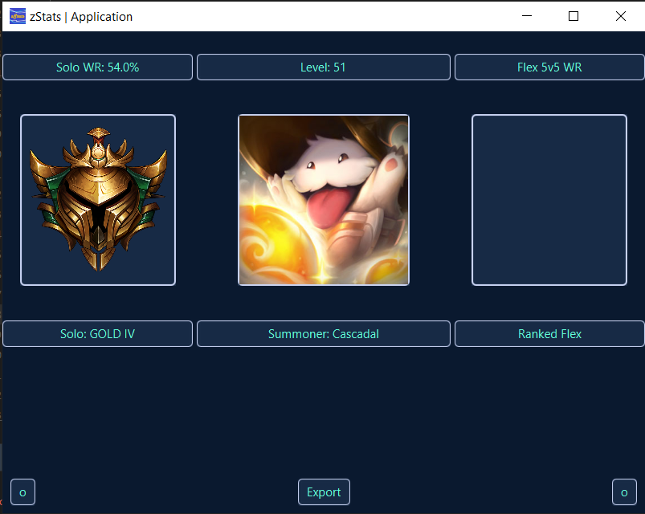
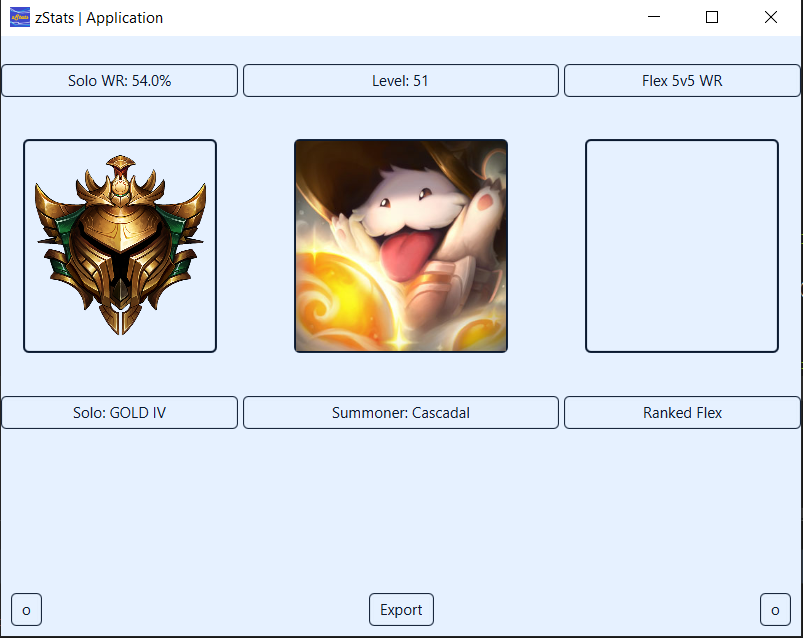
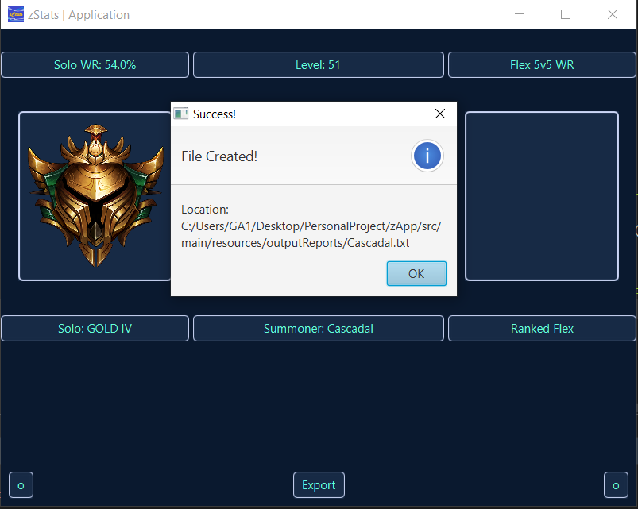
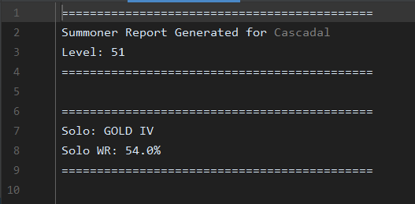

# zStats | Application :sparkles:

zStats is a 2-part project, composed of an application (zApp) and a library (zLibrary) that will make use of the Riot Games API to return information about a selected Summoner.

## Languages + Tools
- [x] Java
- [x] JavaFX (XML, CSS)
- [x] Maven

## Tasks
The following is a collection of tasks I set myself to complete throughout work on zApp.
- [x] [16/11] Creation of Search & Results using GridPanes
- [x] [17/11] Styling of Search & Results using CSS 
- [x] [16/11] Functionality to switch from search to results
- [x] [17/11] Functionality to transfer information from search to results
- [x] [17/11] Functionality to display icon image
- [x] [20/11] Functionality to return all required information
- [x] [20/11] Functionality to use Orianna
- [x] [20/11] Functionality for a light and dark mode
- [x] [21/11] Functionality to export to a text file
- [x] [21/11] Functionality to ensure summoner name contains no special characters
- [x] [21/11] Creation and usage of application icon
- [x] [21/11] Functionality to package as a jar-with-dependencies and run jar
- [ ] Functionality to use zLibrary

## Usage
To make use of zApp on your own computer:
- clone the repository to a folder
- head to the config.properties file and insert the api key where it says 'YOUR_API_KEY'
- create a new maven configuration that packages the app
- find target/app.1.0-SNAPSHOT-jar-with-dependencies.jar and run it
- use the application as intended

## Running App Examples
The following screenshots will provide an overview of the running app, with screenshots to support this.

### Search Screen
Search Screen (Dark & Light Examples)

 

Above are examples of the search screen when loaded. To switch between light and dark mode, bottom left button switches on light mode, bottom right button switches on dark mode.

Error Messages

If the summoner name entered has any special characters, this is displayed and the app will exit.

If either the region or summoner name are blank, this error will display.

### Results Screen
Results Screen (Dark & Light Examples)

Above are examples of the results screen when loaded. To switch between light and dark mode, bottom left button switches on light mode, bottom right button switches on dark mode.

### Export to Text File
Export to Text File Examples

Once a file has been created in the output directory, the following message will display and the app will exit.

Above is an example of an exported text file, it will only show ranked information if the player has a rank.
